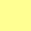
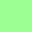

# fluoportrait

The first increment is a GUI-independent C++20 color engine and command-line exporter. It reads RGBA PNG, converts its assumed-sRGB portrait into SDR-range Rec.2020/PQ, composites an independently specified direct-PQ background, writes 4:4:4 JPEG, embeds a caller-selected ICC profile in standard ICC APP2 chunks, and reopens the JPEG to verify the profile byte-for-byte.

```sh
cmake -S . -B build
cmake --build build
ctest --test-dir build --output-on-failure
./build/fluoportrait portrait.png result.jpg \
  --icc "Rec2020 Gamut with PQ Transfer.icc" \
  --background-pq 196,202,156 --sdr-white 400 --quality 100
```

The ICC file is intentionally supplied externally: the project does not redistribute a third-party profile. The exporter attaches it without applying a second color conversion. PNGs carrying a non-sRGB-named ICC profile produce a warning and are treated as sRGB in this version.

See [docs/color-science.md](docs/color-science.md) for the transforms and assumptions.

**Warning: works only on modern HDR-capable displays, such as the Apple Studio Display and some smartphones, and in a browser or application that correctly supports ICC color profiles (Google Chrome, Chromium, Microsoft Edge).**

Here is a color palette of possible background PQ values:

Red rgb(255,147,204) estimated 2851 nits  
 

Yellow 1 rgb(196,202,156) estimated 1304 nits  
 

Yellow 2 rgb(255,255,147) estimated 9419 nits  
 

Green 1 rgb(155,255,147) estimated 6861 nits  
 

Green 2 rgb(147,255,230) estimated 7067 nits  
 

Blue rgb(147,255,255) estimated 7424 nits  
 

Violet rgb(238,147,255) estimated 2125 nits  
 

Ultra white rgb(255,255,255) estimated 10000 nits  
 

If you notice that the color in the large square (64 × 64 px) is the same as the color in the small square (32 × 32 px), rather than appearing brighter, then either your display, your browser, or both do not support this type of bright, fluorescent color. 😕

Here are some examples


